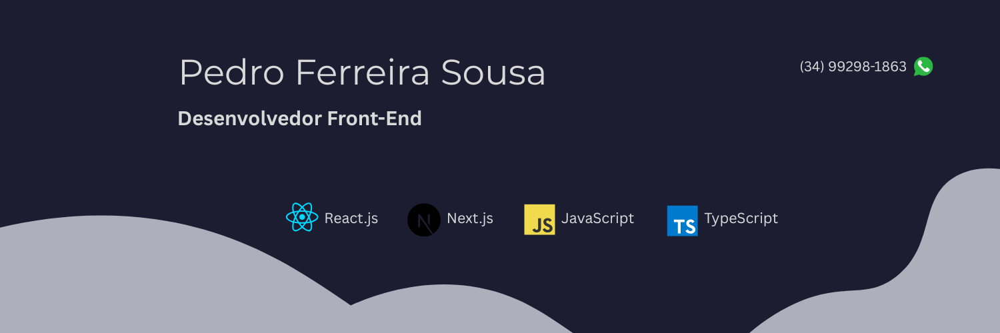

---

  

# Olá! Eu sou o Pedro Ferreira Sousa 👋

**Software Developer** | Typescript | Javascript | Node.js | React | Next.js | Python | Django | PostgreSQL

Desenvolvedor apaixonado por tecnologia, atuando tanto no **Front-end** quanto no **Back-end**. Tenho experiência em criar interfaces modernas, arquiteturas escaláveis e soluções completas para web.

Priorizo código limpo, modular e eficiente, sempre focado na experiência do usuário e na robustez dos sistemas. Trabalho de forma colaborativa, utilizando **Git** e **GitHub** para garantir agilidade e qualidade no desenvolvimento.

Estou em constante evolução, buscando aprender novas tecnologias e enfrentar desafios que impulsionem meu crescimento profissional.

---

## 🛠️ Minhas Habilidades Técnicas

### Linguagens e Frameworks

### Front-end

### Versionamento e Colaboração

### Design e Ferramentas

---

## 📊 Estatísticas do GitHub

  

---

## 🤝 Conecte-se Comigo!

  

---

Feito por Pedro Ferreira Sousa

---
